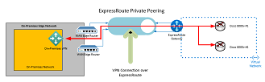
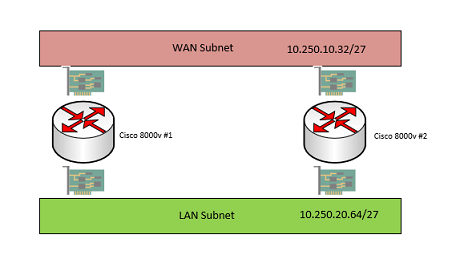

# Cisco Catalyst 8000v
A deployment solution for the Cisco Catalyst 8000V on  Azure 

# A deployment solution for the Cisco Catalyst 8000v on Azure

### The following solution is intended for ITPro’s to leverage for rapid and consistent deployments on Azure that require the Cisco Catalyst 8000V Edge systems within an existing virtual network. 

### You can deploy single or multiple systems within an existing or new Azure virtual network. The current Sku and offer from Cisco is currently Generation One at the time of this writing. 
### If you are planning to deploy a Cisco Catalyst 8000v Edge on Azure, we encourage that you review Cisco's official guidance found here [Deploying Cisco Catalyst 8000V Edge Software on Microsoft Azure](https://www.cisco.com/c/en/us/td/docs/routers/C8000V/Azure/deploying-cisco-catalyst-8000v-on-microsoft-azure/c8000v_microsoftazure_overview.html) . Also please consult with Cisco if you have further questions.

## Solution Options

### The Cisco Catalyst 8000v Edge can be deployed under two consumption models. The first option is defined as Bring your Own License (BYOL) or Pay as you Go (PAYGO). The first option requires you to buy your own license from Cisco so that you can apply to the system and pay for the monthly computing charge from Azure. 
### The second option PAYGO you pay by the size of the virtual machine and the compute hours and do not have to buy a separate license. The two common images are based on either an Advantage or an Essentials sku which provide varying options once deployed. Please consult with your cisco representative to choose the proper option.
### This solution accelerator has the following sku’ s available with the most recent build version which were available at the time of this writing.

*  Cisco Catalyst 8000V-PAYG-DNA Advantage-17.11.01a - x64 Gen1
*  Cisco Catalyst 8000V-PAYG-DNA Essentials-17.11.01a - x64 Gen1
* Cisco Catalyst 8000V Edge Software-BYOL-17.12.01a - x64 Gen1 

 ### The solution can be deployed either in production or development workloads in Azure Commercial and Azure Government. You will be required to have a preexisting virtual network with two separate subnets. The first subnet will support the public facing network interface and the second subnet will support the private network interface. 
 ### Please note that at the end of the virtual machine name we are appending a "-" and the next ordinal number. Example Cisco8000v-1, Cisco8000v-2, etc. Hostnames should not exceed fifteen characters.
 
 ### We are adding a route table, network security group, and availability set for the virtual machines to be deployed in your subscription. Please configure these objects as you see fit. You can also inherit both the existing route tables and network security groups that have already been preconfigured in your environment. The choice is yours.

 ## Common Deployment Scenarios

 ### A common deployment scenario is to deploy the two Cisco Catalyst 8000v on Azure within a Hub virtual network or a single virtual network to create a VPN tunnel within an Azure ExpressRoute to encrypt traffic between Azure and on-premises. The solution can be used with Azure Virtual Wan. Please review the following articles 

 ### The following diagram represents a high-level architecture overview

 #### Figure 1

 

#### Figure 2
 

 

 ### Other deployment options are to leverage the Cisco Catalyst 8000v as a VPN or BGP endpoint within Azure or to on-premises without using the cloud native options. 

 
 ### Feel free to use this solution, edit, and add functionality as you see fit. This solution is provided "as is" for the greater technical community with no guarantees. 
 ### Use the solution with the Azure portal Custom Template Deployment feature or most common pipeline tools.
 ### I would like to recognize Jason Masten, my friend and colleague who refactored my original code and made it world class. Thank you Jason!!
 ### Please enjoy and would love to hear feedback to improve the solution! 

 ## Deployment Solution Below

 ### The following template deploys Cisco Catalyst 8000V virtual machines on an existing virtual network. The following prerequisite are required; an Azure subscription, the name of the Azure resource group that the intended virtual network resides, the name of the virtual network, and the name of the target subnets. 
 ### The person deploying this solution should have the proper administrative rights within the Azure subscription for the deployment to succeed.
